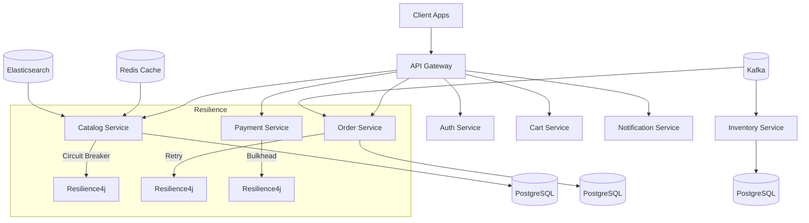

# 🛒 Enterprise E-Commerce System

## 📌 Overview
An enterprise-level **E-Commerce platform** built with **Spring Boot + Spring Cloud**.  
Supports **microservices architecture**, high availability, resilience, and scalability.

---

## 🚀 Tech Stack
- **Backend**: Java 21, Spring Boot 3.x, Spring Cloud
- **Resilience**: Resilience4j (Circuit Breaker, Retry, Bulkhead)
- **Security**: Spring Security (OAuth2, JWT), Keycloak
- **Databases**: PostgreSQL, Redis (cache), Elasticsearch (search)
- **Messaging**: Apache Kafka (event-driven)
- **DevOps**: Docker, Kubernetes, Helm, ArgoCD / Jenkins
- **Observability**: Micrometer, Prometheus, Grafana, OpenTelemetry, ELK

---

## 🧭 Monitoring
- **Metrics**: Micrometer + Prometheus
- **Dashboards**: Grafana
- **Tracing**: OpenTelemetry + Jaeger/Zipkin
- **Logging**: Centralized ELK stack
- **Health Checks**: Actuator endpoints for service health monitoring
- **Alerting**: Prometheus Alertmanager for proactive incident management
- **Distributed Tracing**: End-to-end request tracing across microservices for performance monitoring and debugging
- **Log Correlation**: Structured logging with correlation IDs for easier log analysis
- **Service Mesh**: Future integration with Istio for enhanced observability and traffic management
- **Synthetic Monitoring**: Regular synthetic transactions to monitor critical user flows
- **Anomaly Detection**: Machine learning-based anomaly detection for proactive issue identification
- **Capacity Planning**: Historical data analysis for resource planning and scaling decisions
- **User Behavior Analytics**: Insights into user interactions for improving user experience and conversion rates
- **Incident Management**: Integration with tools like PagerDuty for efficient incident response
---

## 🏗️ Architecture



### 📂 Project Structure
```
apps/
    admin-service/       # Admin microservice
    auth-service/        # Authentication microservice
    analytics-service/  # Analytics microservice
    catalog-service/     # Product catalog microservice
    billing-service/    # Billing microservice
    cart-service/       # Shopping cart microservice
    order-service/      # Order management microservicec
    payment-service/    # Payment processing microservice
    notification-service/ # Notification microservice
    inventory-service/  # Inventory management microservice
    gateway-service/    # API Gateway microservice
config/
    config-server/      # Spring Cloud Config server
infrastructure/
    docker/             # Dockerfiles and Docker Compose
    k8s/                # Kubernetes manifests and Helm charts
    terraform/          # Terraform scripts for cloud infrastructure
libs/
    common/             # Shared libraries and utilities
    security/           # Security-related libraries
    resilience/         # Resilience4j configurations
```

### 🔒 Resilience Patterns
- **Circuit Breaker**: Implemented using Resilience4j (`@CircuitBreaker`) to protect services from cascading failures.
- **Retry & Timeout**: Configured to automatically retry failed requests and apply timeouts, enhancing system stability.
- **Bulkhead**: Service isolation through Bulkhead pattern, preventing resource exhaustion and improving fault tolerance.
- **Rate Limiting**: Enforced at the API Gateway level with Redis integration to control request rates and prevent abuse.
- **Saga Pattern**: Distributed transaction management across Order, Payment, and Inventory services for data consistency.
- **Fallback Mechanisms**: Graceful degradation strategies to maintain user experience during service outages.
- **Health Checks**: Regular health monitoring of services using Spring Boot Actuator endpoints.
- **Load Balancing**: Client-side load balancing with Spring Cloud LoadBalancer for efficient request

### 📊 Observability

- **Metrics**: Micrometer + Prometheus
- **Dashboards**: Grafana
- **Tracing**: OpenTelemetry + Jaeger/Zipkin
- **Logging**: Centralized ELK stack
- **Health Checks**: Actuator endpoints for service health monitoring
- **Alerting**: Prometheus Alertmanager for proactive incident management
- **Distributed Tracing**: End-to-end request tracing across microservices for performance monitoring and debugging
- **Log Correlation**: Structured logging with correlation IDs for easier log analysis
- **Service Mesh**: Future integration with Istio for enhanced observability and traffic management

### 🔐 Security
- **Authentication**: OAuth2 with JWT tokens, integrated with Keycloak
- **Authorization**: Role-based access control (RBAC) using Spring Security
- **Data Protection**: HTTPS, data encryption at rest and in transit
- **Vulnerability Scanning**: Regular scans using tools like Snyk and OWASP
- **Secrets Management**: HashiCorp Vault for managing sensitive configurations
- **Compliance**: GDPR and PCI-DSS compliance for handling user data and payments
- **Security Audits**: Regular security assessments and penetration testing
- **Incident Response**: Established protocols for handling security incidents and breaches
- **Monitoring & Alerts**: Continuous monitoring for suspicious activities and alerting mechanisms
- **Dependency Management**: Regular updates and patching of dependencies to mitigate vulnerabilities
- **Security Training**: Ongoing training for developers on secure coding practices
- **API Security**: Implementation of API gateways with rate limiting, IP whitelisting, and request validation
- **Content Security Policy (CSP)**: Enforced to prevent XSS attacks
- **CORS Policies**: Configured to restrict resource access from unauthorized domains
- **Security Headers**: Implementation of HTTP security headers (e.g., HSTS, X-Content-Type-Options)
- **Audit Logging**: Comprehensive logging of security-related events for compliance and forensic analysis
- **Third-Party Integrations**: Secure integration with third-party services using OAuth2 and API keys
- **Regular Updates**: Keeping all software components up-to-date with the latest security patches
- **Backup & Recovery**: Regular backups and tested recovery procedures to ensure data integrity
- **User Education**: Informing users about security best practices, such as strong passwords and phishing awareness
- **Multi-Factor Authentication (MFA)**: Optional MFA for enhanced user account security
- **Session Management**: Secure session handling with appropriate timeouts and invalidation mechanisms
- **Data Anonymization**: Techniques applied to sensitive data to protect user privacy
- **Security Champions**: Designated team members to advocate for security best practices within development teams

### 📌 Roadmap

- Add Redis cache layer for Catalog \& Cart
- Integrate Kafka events for Order → Inventory flow
- Add Circuit Breakers (Resilience4j)
- Add Prometheus \+ Grafana observability
- Deploy to Kubernetes with Helm
- Introduce Service Mesh (Istio) for mTLS \& traffic shaping
- Implement OAuth2 with Keycloak
- Set up CI/CD with Jenkins / ArgoCD
- Implement distributed tracing with OpenTelemetry
- Enhance security with Vault for secrets management
- Implement advanced rate limiting and API security measures
- Conduct regular security audits and vulnerability assessments
- Explore AI/ML for personalized recommendations and fraud detection
- Expand microservices for reviews, wishlists, and recommendations
- Optimize performance with caching strategies and database indexing
- Explore GraphQL for flexible client queries
- Implement A/B testing framework for feature experimentation
- Explore serverless functions for specific workloads
- Expand to multi-region deployments for global reach
- Continuously improve based on user feedback and analytics
- Stay updated with latest tech trends and best practices
- Foster a culture of continuous learning and innovation within the team
- Engage with the developer community through open-source contributions and knowledge sharing
- Regularly review and refine the architecture to ensure scalability, maintainability, and performance