# 🛒 YaniQ E-Commerce Microservices Platform

<div align="center">


[](https://openjdk.org/)
[](https://spring.io/projects/spring-boot)
[](https://spring.io/projects/spring-cloud)
[](LICENSE)

**Enterprise-grade microservices architecture for modern e-commerce**

[Getting Started](#-getting-started) •
[Architecture](#-architecture) •
[Services](#-services) •
[Documentation](#-documentation) •
[Contributing](#-contributing)

</div>

---

## 📋 Table of Contents

- [Overview](#-overview)
- [Key Features](#-key-features)
- [Technology Stack](#-technology-stack)
- [Architecture](#-architecture)
- [Services](#-services)
- [Getting Started](#-getting-started)
- [Documentation](#-documentation)
- [Development Status](#-development-status)
- [Contributing](#-contributing)
- [License](#-license)

---

## 🌟 Overview

**YaniQ** is a comprehensive, enterprise-level e-commerce platform built with **Spring Boot 3.x** and **Spring Cloud**, designed for high availability, scalability, and resilience. The platform follows modern microservices architecture patterns with event-driven design, distributed tracing, and comprehensive observability.

### Why YaniQ?

- ✅ **Production-Ready**: Battle-tested patterns and industry best practices
- 🚀 **Scalable**: Horizontal scaling with Kubernetes and Docker
- 🔒 **Secure**: OAuth2, JWT, and role-based access control
- 🔄 **Resilient**: Circuit breakers, retries, and fallback mechanisms
- 📊 **Observable**: Complete monitoring, logging, and tracing
- 🎯 **Event-Driven**: Apache Kafka for asynchronous communication

---

## 🎯 Key Features

### Business Features
- 🛍️ **Product Catalog Management** - Multi-category product organization
- 🛒 **Shopping Cart** - Real-time cart management with Redis caching
- 💳 **Payment Processing** - Multiple payment gateway integrations
- 📦 **Order Management** - Complete order lifecycle tracking
- 🚚 **Shipping Integration** - Real-time shipping and tracking
- 📊 **Analytics & Reporting** - Business intelligence and insights
- 🎁 **Promotions & Loyalty** - Discount codes and loyalty programs
- ⭐ **Reviews & Ratings** - Customer feedback system
- 🔍 **Advanced Search** - Elasticsearch-powered product search
- 🎯 **Recommendations** - AI-powered product recommendations

### Technical Features
- 🔐 **Authentication & Authorization** - OAuth2 + JWT with Keycloak
- 🌐 **API Gateway** - Spring Cloud Gateway with rate limiting
- 🔍 **Service Discovery** - Eureka Server (Production-Ready ✅)
- 📢 **Event Streaming** - Apache Kafka for event-driven architecture
- 💾 **Distributed Caching** - Redis for high-performance caching
- 🔄 **Resilience Patterns** - Resilience4j (Circuit Breaker, Retry, Bulkhead)
- 📊 **Observability** - Prometheus, Grafana, ELK Stack, OpenTelemetry
- 🐳 **Containerization** - Docker & Kubernetes deployment
- 🔧 **Configuration Management** - Spring Cloud Config Server
- 🏥 **Health Checks** - Spring Boot Actuator endpoints

---

## 🛠️ Technology Stack

### Core Framework
```yaml
Framework: Spring Boot 3.5.5
Language: Java 21
Build Tool: Maven 3.x
Cloud Framework: Spring Cloud 2025.0.0
```

### Infrastructure
| Component | Technology | Purpose |
|-----------|------------|---------|
| **Service Discovery** | Eureka Server | Service registration and discovery |
| **API Gateway** | Spring Cloud Gateway | Routing, load balancing, rate limiting |
| **Configuration** | Spring Cloud Config | Centralized configuration management |
| **Message Queue** | Apache Kafka | Event-driven communication |
| **Caching** | Redis | Distributed caching layer |
| **Search Engine** | Elasticsearch | Full-text search and analytics |

### Data Storage
| Database | Usage |
|----------|-------|
| **PostgreSQL** | Primary relational database (per service) |
| **Redis** | Session storage and distributed cache |
| **Elasticsearch** | Product search and analytics |

### Security
- **Spring Security** - Authentication and authorization
- **OAuth2 & JWT** - Token-based security
- **Keycloak** - Identity and access management (planned)

### Observability & Monitoring
| Tool | Purpose |
|------|---------|
| **Prometheus** | Metrics collection and alerting |
| **Grafana** | Metrics visualization and dashboards |
| **ELK Stack** | Centralized logging (Elasticsearch, Logstash, Kibana) |
| **OpenTelemetry** | Distributed tracing |
| **Jaeger/Zipkin** | Trace visualization |
| **Micrometer** | Application metrics |
| **Spring Boot Actuator** | Health checks and management endpoints |

### Resilience & Reliability
- **Resilience4j** - Circuit breaker, retry, rate limiter, bulkhead
- **Spring Cloud LoadBalancer** - Client-side load balancing
- **Saga Pattern** - Distributed transaction management

### DevOps & Deployment
- **Docker** - Containerization
- **Kubernetes** - Container orchestration
- **Helm** - Kubernetes package manager
- **Jenkins** - CI/CD pipeline
- **ArgoCD** - GitOps continuous delivery (planned)
- **Terraform** - Infrastructure as Code (planned)

---

## 🏗️ Architecture

### High-Level Architecture Diagram

```mermaid
flowchart TB
    subgraph "Client Layer"
        WEB[Web Application]
        MOBILE[Mobile Apps]
        ADMIN[Admin Portal]
    end

    subgraph "API Gateway Layer"
        GW[API Gateway<br/>Port: 8080]
    end

    subgraph "Service Discovery"
        EUREKA[Eureka Server<br/>Port: 8761<br/>✅ Production Ready]
    end

    subgraph "Core Services"
        AUTH[Auth Service<br/>Port: 8081<br/>🚧 In Development]
        USER[User Service<br/>Port: 8082<br/>🚧 In Development]
        NOTIF[Notification Service<br/>Port: 8088<br/>🚧 In Development]
    end

    subgraph "Business Services"
        PRODUCT[Product Service<br/>Port: 8083<br/>🚧 In Development]
        CART[Cart Service<br/>Port: 8086<br/>🚧 In Development]
        ORDER[Order Service<br/>Port: 8084<br/>🚧 In Development]
        PAYMENT[Payment Service<br/>Port: 8085<br/>🚧 In Development]
        INVENTORY[Inventory Service<br/>Port: 8087<br/>🚧 In Development]
    end

    subgraph "Supporting Services"
        SHIPPING[Shipping Service<br/>🚧 In Development]
        REVIEW[Review Service<br/>🚧 In Development]
        PROMO[Promotion Service<br/>🚧 In Development]
        ANALYTICS[Analytics Service<br/>Port: 8089<br/>🚧 In Development]
        SEARCH[Search Service<br/>🚧 In Development]
        RECOMMEND[Recommendation Service<br/>🚧 In Development]
    end

    subgraph "Data Layer"
        POSTGRES[(PostgreSQL<br/>Per Service DB)]
        REDIS[(Redis Cache)]
        ELASTIC[(Elasticsearch)]
    end

    subgraph "Messaging Layer"
        KAFKA[Apache Kafka<br/>Event Streaming]
    end

    subgraph "Observability"
        PROMETHEUS[Prometheus]
        GRAFANA[Grafana]
        ELK[ELK Stack]
    end

    WEB --> GW
    MOBILE --> GW
    ADMIN --> GW
    
    GW --> AUTH
    GW --> USER
    GW --> PRODUCT
    GW --> CART
    GW --> ORDER
    GW --> PAYMENT
    
    AUTH -.->|Register| EUREKA
    USER -.->|Register| EUREKA
    PRODUCT -.->|Register| EUREKA
    CART -.->|Register| EUREKA
    ORDER -.->|Register| EUREKA
    PAYMENT -.->|Register| EUREKA
    INVENTORY -.->|Register| EUREKA
    NOTIF -.->|Register| EUREKA
    
    GW -.->|Discover| EUREKA
    
    ORDER --> KAFKA
    PAYMENT --> KAFKA
    INVENTORY --> KAFKA
    KAFKA --> NOTIF
    
    PRODUCT --> REDIS
    CART --> REDIS
    
    PRODUCT --> ELASTIC
    SEARCH --> ELASTIC
    
    AUTH --> POSTGRES
    USER --> POSTGRES
    PRODUCT --> POSTGRES
    ORDER --> POSTGRES
    PAYMENT --> POSTGRES
    INVENTORY --> POSTGRES
    
    AUTH -.->|Metrics| PROMETHEUS
    USER -.->|Metrics| PROMETHEUS
    PRODUCT -.->|Metrics| PROMETHEUS
    
    PROMETHEUS --> GRAFANA
    AUTH -.->|Logs| ELK
    USER -.->|Logs| ELK

    style EUREKA fill:#00FF00,stroke:#006400,stroke-width:3px,color:#000
    style GW fill:#87CEEB,stroke:#4682B4,stroke-width:2px
    style AUTH fill:#FFE4B5,stroke:#FF8C00,stroke-width:2px
    style ORDER fill:#FFE4B5,stroke:#FF8C00,stroke-width:2px
    style KAFKA fill:#FF6B6B,stroke:#C92A2A,stroke-width:2px
    style POSTGRES fill:#336791,stroke:#1A3A52,stroke-width:2px,color:#FFF
    style REDIS fill:#DC382D,stroke:#8B0000,stroke-width:2px,color:#FFF
```



### Architecture Principles

1. **Microservices Architecture** - Independently deployable services
2. **Domain-Driven Design** - Business domain-focused service boundaries
3. **API Gateway Pattern** - Single entry point for all client requests
4. **Service Discovery** - Dynamic service registration and discovery
5. **Event-Driven** - Asynchronous communication via message queues
6. **Database per Service** - Each service owns its data
7. **Circuit Breaker Pattern** - Fault tolerance and resilience
8. **CQRS** - Command Query Responsibility Segregation (planned)
9. **Saga Pattern** - Distributed transaction management

📖 **[Read more about Architecture →](./ARCHITECTURE.md)**

---

## 🚀 Services

### ✅ Production-Ready Services

#### Discovery Service (Eureka Server)
**Status**: ✅ **Production Ready** | **Port**: 8761

The service registry that enables microservices to discover and communicate with each other dynamically.

**Features**:
- Service registration and health monitoring
- Load balancing support
- High availability configuration
- Dashboard UI for service monitoring

**Quick Access**:
- 🌐 Dashboard: http://localhost:8761
- 📊 Health: http://localhost:8761/actuator/health

📖 **[Complete Documentation →](./services/DISCOVERY_SERVICE.md)**

---

### 🚧 Services in Development

#### 1. Gateway Service
**Port**: 8080 | **Status**: 🚧 In Development

API Gateway providing routing, load balancing, rate limiting, and security.

**Features**:
- Dynamic routing with service discovery
- Rate limiting with Redis
- JWT authentication
- Request/response transformation
- Circuit breaker integration

#### 2. Auth Service
**Port**: 8081 | **Status**: 🚧 In Development

Authentication and authorization service with OAuth2 and JWT support.

**Features**:
- User authentication (login/logout)
- JWT token generation and validation
- Password reset and recovery
- OAuth2 integration
- Role-based access control

#### 3. User Service
**Port**: 8082 | **Status**: 🚧 In Development

User management and profile service.

**Features**:
- User registration and profile management
- Address management
- User preferences
- Account settings

#### 4. Product Service
**Port**: 8083 | **Status**: 🚧 In Development

Product catalog management service.

**Features**:
- Product CRUD operations
- Category management
- Product images and media
- Inventory integration
- Elasticsearch indexing

#### 5. Order Service
**Port**: 8084 | **Status**: 🚧 In Development

Order processing and management service.

**Features**:
- Order creation and tracking
- Order status management
- Order history
- Integration with payment and shipping

#### 6. Payment Service
**Port**: 8085 | **Status**: 🚧 In Development

Payment processing service with multiple gateway support.

**Features**:
- Payment gateway integration
- Payment method management
- Transaction tracking
- Refund processing

#### 7. Cart Service
**Port**: 8086 | **Status**: 🚧 In Development

Shopping cart management with Redis caching.

**Features**:
- Add/remove cart items
- Cart persistence
- Price calculations
- Checkout preparation

#### 8. Inventory Service
**Port**: 8087 | **Status**: 🚧 In Development

Inventory and stock management service.

**Features**:
- Stock level tracking
- Inventory updates
- Low stock alerts
- Warehouse management

#### 9. Notification Service
**Port**: 8088 | **Status**: 🚧 In Development

Multi-channel notification service.

**Features**:
- Email notifications
- SMS notifications (planned)
- Push notifications (planned)
- Notification templates
- Event-driven notifications via Kafka

#### 10. Analytics Service
**Port**: 8089 | **Status**: 🚧 In Development

Business analytics and reporting service.

**Features**:
- Sales analytics
- User behavior tracking
- Custom reports
- Dashboard data aggregation

#### Additional Services (Planned)

- **Shipping Service** - Shipping provider integration and tracking
- **Review Service** - Product reviews and ratings
- **Promotion Service** - Discount codes and promotional campaigns
- **Search Service** - Advanced product search with Elasticsearch
- **Recommendation Service** - AI-powered product recommendations
- **Loyalty Service** - Customer loyalty and rewards program
- **Support Service** - Customer support and ticketing
- **Admin Service** - Administrative operations
- **Billing Service** - Billing and invoicing
- **Catalog Service** - Advanced catalog management
- **File Service** - File upload and management

---

## 🚀 Getting Started

### Prerequisites

- **Java 21** or higher
- **Maven 3.8+**
- **Docker & Docker Compose**
- **PostgreSQL 15+**
- **Redis 7+**
- **Apache Kafka** (optional for local dev)

### Quick Start

#### 1. Clone the Repository

```bash
git clone https://github.com/yaniq/yaniq-monorepo.git
cd yaniq-monorepo
```

#### 2. Start Infrastructure Services

```bash
# Start PostgreSQL, Redis, Kafka using Docker Compose
docker-compose up -d
```

#### 3. Build All Services

```bash
# Build the entire monorepo
mvn clean install -DskipTests
```

#### 4. Start Discovery Service (Required First)

```bash
# Start Eureka Server
cd apps/discovery-service
mvn spring-boot:run
```

Wait for Eureka to start completely (usually 30-60 seconds). Verify at: http://localhost:8761

#### 5. Start Other Services

```bash
# In separate terminals, start each service:

# Gateway Service
cd apps/gateway-service && mvn spring-boot:run

# Auth Service
cd apps/auth-service && mvn spring-boot:run

# Additional services as needed...
```

#### 6. Verify Services

- **Eureka Dashboard**: http://localhost:8761
- **API Gateway**: http://localhost:8080
- **Service Health**: http://localhost:{port}/actuator/health

### Docker Deployment

```bash
# Build and run all services with Docker Compose
docker-compose -f docker-compose.yml up -d

# Check service status
docker-compose ps

# View logs
docker-compose logs -f [service-name]
```

### Kubernetes Deployment

```bash
# Apply Kubernetes manifests
kubectl apply -f k8s/

# Or using Helm
helm install yaniq ./helm/yaniq
```

📖 **[Complete Getting Started Guide →](./GETTING_STARTED.md)**

---

## 📚 Documentation

### Core Documentation
- 📖 **[Architecture Overview](./ARCHITECTURE.md)** - System architecture and design patterns
- 🚀 **[Getting Started Guide](./GETTING_STARTED.md)** - Setup and installation instructions
- ⚙️ **[Configuration Guide](./CONFIGURATION.md)** - Configuration management
- 🚀 **[Deployment Guide](./DEPLOYMENT.md)** - Docker, Kubernetes, and cloud deployment
- 🤝 **[Contributing Guidelines](./CONTRIBUTING.md)** - How to contribute to the project
- 🔧 **[Troubleshooting](./TROUBLESHOOTING.md)** - Common issues and solutions

### Service Documentation

#### Production-Ready Services
- ✅ **[Discovery Service](./services/DISCOVERY_SERVICE.md)** - Eureka Server (Complete)

#### Services in Development
- 🚧 **[Gateway Service](./services/GATEWAY_SERVICE.md)** - API Gateway
- 🚧 **[Auth Service](./services/AUTH_SERVICE.md)** - Authentication
- 🚧 **[User Service](./services/USER_SERVICE.md)** - User Management
- 🚧 **[Product Service](./services/PRODUCT_SERVICE.md)** - Product Catalog
- 🚧 **[Order Service](./services/ORDER_SERVICE.md)** - Order Processing
- 🚧 **[Payment Service](./services/PAYMENT_SERVICE.md)** - Payment Processing
- 🚧 **[Cart Service](./services/CART_SERVICE.md)** - Shopping Cart
- 🚧 **[Inventory Service](./services/INVENTORY_SERVICE.md)** - Inventory Management
- 🚧 **[Notification Service](./services/NOTIFICATION_SERVICE.md)** - Notifications

### Library Documentation
- 📚 **[Common Libraries](./LIBRARIES/)** - Shared libraries and utilities
  - [Common API](./LIBRARIES/common-api/)
  - [Common Audit](./LIBRARIES/common-audit/)
  - [Common Exceptions](./LIBRARIES/common-exceptions/)
  - [Common Messaging](./LIBRARIES/common-messaging/)
  - [Common Logging](./LIBRARIES/common-logging/)

### API Documentation
- 🔗 **[Swagger/OpenAPI](./SWAGGER_DOCUMENTATION.md)** - Interactive API documentation
- 📡 **[API Reference](./API/)** - Detailed API endpoints

---

## 📊 Development Status

### Project Overview

| Category | Total | Complete | In Progress | Planned |
|----------|-------|----------|-------------|---------|
| **Services** | 22 | 1 | 8 | 13 |
| **Libraries** | 14 | 5 | 4 | 5 |
| **Documentation** | 25 | 3 | 22 | 0 |

### Service Status Matrix

| Service | Status | Port | Database | Documentation |
|---------|--------|------|----------|---------------|
| Discovery Service | ✅ Complete | 8761 | - | ✅ Complete |
| Gateway Service | 🚧 In Dev | 8080 | - | 🚧 In Progress |
| Auth Service | 🚧 In Dev | 8081 | PostgreSQL | 🚧 In Progress |
| User Service | 🚧 In Dev | 8082 | PostgreSQL | 🚧 In Progress |
| Product Service | 🚧 In Dev | 8083 | PostgreSQL | 🚧 In Progress |
| Order Service | 🚧 In Dev | 8084 | PostgreSQL | 🚧 In Progress |
| Payment Service | 🚧 In Dev | 8085 | PostgreSQL | 🚧 In Progress |
| Cart Service | 🚧 In Dev | 8086 | Redis | 🚧 In Progress |
| Inventory Service | 🚧 In Dev | 8087 | PostgreSQL | 🚧 In Progress |
| Notification Service | 🚧 In Dev | 8088 | PostgreSQL | 🚧 In Progress |
| Analytics Service | 🚧 In Dev | 8089 | PostgreSQL | 🚧 In Progress |
| Other Services | 📅 Planned | TBD | TBD | 📅 Planned |

**Legend**:
- ✅ Complete - Production ready
- 🚧 In Development - Active development
- 📅 Planned - Not yet started

---

## 🤝 Contributing

We welcome contributions! Please see our [Contributing Guidelines](./CONTRIBUTING.md) for details.

### How to Contribute

1. **Fork the repository**
2. **Create a feature branch** (`git checkout -b feature/amazing-feature`)
3. **Commit your changes** (`git commit -m 'Add some amazing feature'`)
4. **Push to the branch** (`git push origin feature/amazing-feature`)
5. **Open a Pull Request**

### Development Guidelines

- Follow Java code conventions
- Write unit tests for new features
- Update documentation
- Ensure all tests pass
- Follow commit message conventions

---

## 📄 License

This project is licensed under the **Apache License 2.0** - see the [LICENSE](../LICENSE) file for details.

---

## 👥 Team

**Lead Developer**: Danukaji Hansanath  
**Email**: danukajihansanath0408@gmail.com  
**Organization**: YaniQ

---

## 🔗 Links

- 🌐 **Website**: [https://yaniq.com](https://yaniq.com)
- 📖 **Documentation**: [https://docs.yaniq.com](https://docs.yaniq.com)
- 🐛 **Issue Tracker**: [GitHub Issues](https://github.com/yaniq/yaniq-monorepo/issues)
- 💬 **Discussions**: [GitHub Discussions](https://github.com/yaniq/yaniq-monorepo/discussions)

---

## 🌟 Star History

If you find this project useful, please consider giving it a ⭐!

---

<div align="center">

**Built with ❤️ by the YaniQ Team**

[⬆ Back to Top](#-yaniq-e-commerce-microservices-platform)

</div>

