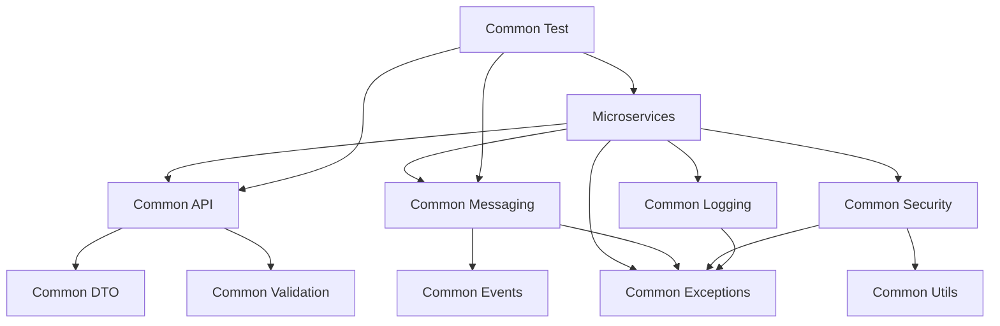

# Shared Libraries
{: .fs-9 }

Reusable components and utilities powering all YaniQ microservices.
{: .fs-6 .fw-300 }

---

## 📚 Overview

YaniQ provides **14+ shared libraries** that promote code reuse, consistency, and maintainability across all microservices. These libraries encapsulate common functionality, reducing duplication and accelerating development.

### Key Benefits

✅ **Code Reuse** - Write once, use everywhere  
✅ **Consistency** - Standardized patterns across all services  
✅ **Maintainability** - Single source of truth for common functionality  
✅ **Productivity** - Faster service development with pre-built components  
✅ **Quality** - Well-tested, production-ready components  
✅ **Type Safety** - Strongly typed with Java 21  

---

## 📦 Available Libraries

### Core Infrastructure Libraries

#### 🔧 Common API
**Package:** `com.yaniq.common.api`  
**Status:** ✅ Active

Standardized REST API components, DTOs, and utilities.

- Base controller classes
- Standard response wrappers
- Pagination support
- API versioning utilities
- Exception handling

[View Documentation →](/libraries/common-api)

---

#### 🔍 Common Audit
**Package:** `com.yaniq.common.audit`  
**Status:** ✅ Active

Audit logging and change tracking for all entities.

- Entity auditing (created/updated timestamps)
- User tracking (who created/modified)
- Change history
- Audit event listeners
- Compliance reporting

[View Documentation →](/libraries/common-audit)

---

#### ⚡ Common Cache
**Package:** `com.yaniq.common.cache`  
**Status:** 🚧 In Development

Redis-based caching abstractions and utilities.

- Cache annotations
- Cache configuration
- Distributed caching
- Cache invalidation strategies
- Cache warming utilities

[View Documentation →](/libraries/common-cache)

---

#### ⚙️ Common Config
**Package:** `com.yaniq.common.config`  
**Status:** 🚧 In Development

Shared configuration classes and utilities.

- Database configuration
- Security configuration
- Kafka configuration
- Redis configuration
- Common beans

[View Documentation →](/libraries/common-config)

---

### Data & Messaging Libraries

#### 📨 Common Messaging
**Package:** `com.yaniq.common.messaging`  
**Status:** ✅ Active

Kafka event publishing and consumption utilities.

- Event producers and consumers
- Message serialization
- Event schemas
- Dead letter queue handling
- Retry mechanisms

[View Documentation →](/libraries/common-messaging)

---

#### 🎯 Common Events
**Package:** `com.yaniq.common.events`  
**Status:** 🚧 In Development

Domain event definitions and event sourcing support.

- Standard event types
- Event schemas
- Event versioning
- Event replay utilities
- Event store integration

[View Documentation →](/libraries/common-events)

---

#### 📋 Common DTO
**Package:** `com.yaniq.common.dto`  
**Status:** 🚧 In Development

Shared Data Transfer Objects used across services.

- Request/response DTOs
- Validation annotations
- DTO mapping utilities
- Serialization support
- API contracts

[View Documentation →](/libraries/common-dto)

---

#### 🗄️ Common Models
**Package:** `com.yaniq.common.models`  
**Status:** 🚧 In Development

Shared domain models and entities.

- Base entity classes
- Value objects
- Enumerations
- Domain exceptions
- Entity builders

[View Documentation →](/libraries/common-models)

---

### Security & Validation Libraries

#### 🔐 Common Security
**Package:** `com.yaniq.common.security`  
**Status:** 🚧 In Development

Security utilities and authentication components.

- JWT utilities
- Authentication filters
- Authorization helpers
- Security context management
- Role-based access utilities

[View Documentation →](/libraries/common-security)

---

#### ✅ Common Validation
**Package:** `com.yaniq.common.validation`  
**Status:** 🚧 In Development

Custom validators and validation utilities.

- Custom validation annotations
- Business rule validators
- Cross-field validation
- Validation groups
- Error message handling

[View Documentation →](/libraries/common-validation)

---

### Utility Libraries

#### 🛠️ Common Utils
**Package:** `com.yaniq.common.utils`  
**Status:** 🚧 In Development

General-purpose utility classes.

- Date/time utilities
- String utilities
- Collection utilities
- Encryption/decryption helpers
- ID generators

[View Documentation →](/libraries/common-utils)

---

#### ❌ Common Exceptions
**Package:** `com.yaniq.common.exceptions`  
**Status:** ✅ Active

Standardized exception hierarchy and error handling.

- Base exception classes
- Business exceptions
- Technical exceptions
- Error codes
- Exception mappers

[View Documentation →](/libraries/common-exceptions)

---

#### 📝 Common Logging
**Package:** `com.yaniq.common.logging`  
**Status:** ✅ Active

Structured logging and correlation ID management.

- Structured logging utilities
- Correlation ID tracking
- Log masking for sensitive data
- Performance logging
- Request/response logging

[View Documentation →](/libraries/common-logging)

---

#### 🧪 Common Test
**Package:** `com.yaniq.common.test`  
**Status:** 🚧 In Development

Testing utilities and base test classes.

- Test base classes
- Mock data builders
- Test containers configuration
- Integration test utilities
- Performance test helpers

[View Documentation →](/libraries/common-test)

---

## 🚀 Quick Start

### Adding a Library to Your Service

Add the dependency to your service's `pom.xml`:

```xml
<dependency>
    <groupId>com.yaniq</groupId>
    <artifactId>common-messaging</artifactId>
    <version>${project.version}</version>
</dependency>
```

### Example: Using Common Messaging

```java
import com.yaniq.common.messaging.EventPublisher;
import com.yaniq.common.messaging.events.OrderCreatedEvent;

@Service
public class OrderService {
    
    private final EventPublisher eventPublisher;
    
    public void createOrder(Order order) {
        // Business logic
        orderRepository.save(order);
        
        // Publish event
        OrderCreatedEvent event = new OrderCreatedEvent(
            order.getId(),
            order.getUserId(),
            order.getTotal()
        );
        eventPublisher.publish("order.created", event);
    }
}
```

### Example: Using Common Exceptions

```java
import com.yaniq.common.exceptions.ResourceNotFoundException;
import com.yaniq.common.exceptions.BusinessException;

@Service
public class ProductService {
    
    public Product getProduct(Long id) {
        return productRepository.findById(id)
            .orElseThrow(() -> new ResourceNotFoundException(
                "Product", "id", id
            ));
    }
    
    public void updateStock(Long productId, int quantity) {
        if (quantity < 0) {
            throw new BusinessException(
                "INVALID_QUANTITY",
                "Stock quantity cannot be negative"
            );
        }
        // Update logic
    }
}
```

---

## 🏗️ Library Architecture

Each library follows a consistent structure:

```
common-[library-name]/
├── src/
│   ├── main/
│   │   ├── java/
│   │   │   └── com/yaniq/common/[library-name]/
│   │   │       ├── config/          # Auto-configuration
│   │   │       ├── [components]/    # Main functionality
│   │   │       └── [utilities]/     # Helper classes
│   │   └── resources/
│   │       ├── META-INF/
│   │       │   └── spring.factories # Spring Boot auto-config
│   │       └── application.yml      # Default configuration
│   └── test/
│       └── java/                    # Unit tests
├── pom.xml
└── README.md
```

---

## 📊 Library Dependencies



---

## 🔄 Version Management

All libraries use the parent POM version:

```xml
<parent>
    <groupId>com.yaniq</groupId>
    <artifactId>yaniq</artifactId>
    <version>1.0.0</version>
</parent>
```

Libraries are versioned together to ensure compatibility.

---

## 📝 Development Guidelines

### Creating a New Library

1. **Identify Reusable Code** - Look for duplicated code across services
2. **Design the API** - Create clean, intuitive interfaces
3. **Follow Naming Convention** - Use `common-[purpose]` pattern
4. **Add Auto-Configuration** - Use Spring Boot auto-configuration
5. **Write Tests** - Minimum 80% code coverage
6. **Document** - Add comprehensive documentation
7. **Version** - Follow semantic versioning

### Best Practices

✅ **Keep libraries focused** - Single responsibility principle  
✅ **Minimize dependencies** - Avoid unnecessary external dependencies  
✅ **Backward compatibility** - Don't break existing APIs  
✅ **Comprehensive tests** - Test all public APIs  
✅ **Good documentation** - README, Javadoc, and examples  
✅ **Performance** - Optimize for common use cases  

---

## 🧪 Testing Libraries

### Unit Testing

```bash
# Test a specific library
cd libs/common-messaging
mvn test

# Test all libraries
mvn test -pl libs/
```

### Integration Testing

```bash
# Run integration tests
mvn verify -Pintegration-tests
```

---

## 📖 Library Documentation

Each library includes:

- **README.md** - Overview and quick start
- **USAGE.md** - Detailed usage examples
- **DEPENDENCIES.md** - Dependency information
- **CHANGELOG.md** - Version history
- **API Documentation** - Javadoc

---

## 🔗 Related Documentation

- [Architecture Overview](/ARCHITECTURE) - System architecture
- [Getting Started](/GETTING_STARTED) - Development setup
- [Services Overview](/services) - All microservices
- [Contributing Guide](/CONTRIBUTING) - Contribution guidelines

---

## 📊 Library Status Summary

| Category | Active | In Development | Planned |
|----------|--------|----------------|---------|
| **Infrastructure** | 3 | 1 | 0 |
| **Data & Messaging** | 1 | 3 | 0 |
| **Security** | 0 | 2 | 0 |
| **Utilities** | 2 | 2 | 0 |
| **Total** | **6** | **8** | **0** |

---

{: .note }
> **Active Development:** Libraries marked as "In Development" are being actively worked on and may have unstable APIs.

{: .highlight }
> **Latest Version:** 1.0.0 | **Last Updated:** October 2025 | **Total Libraries:** 14+
