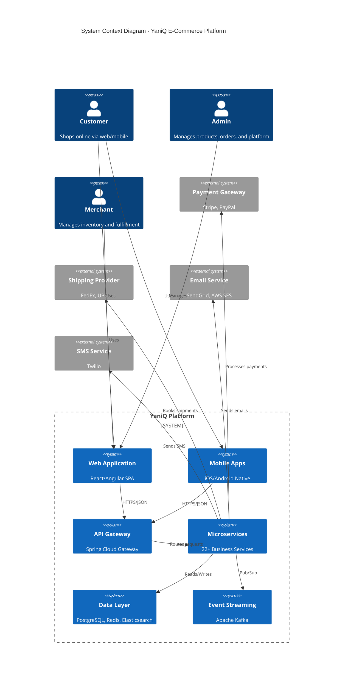
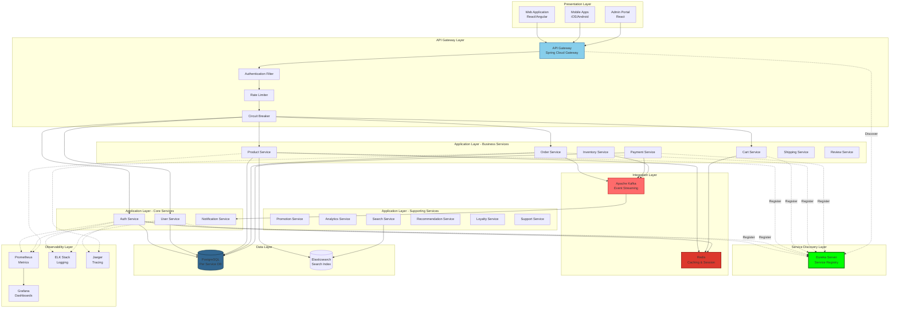
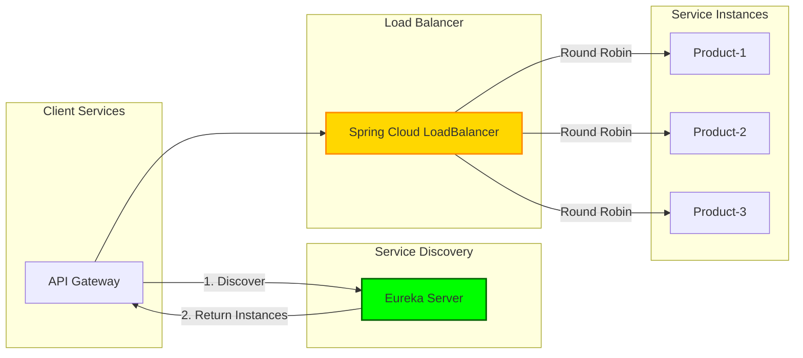
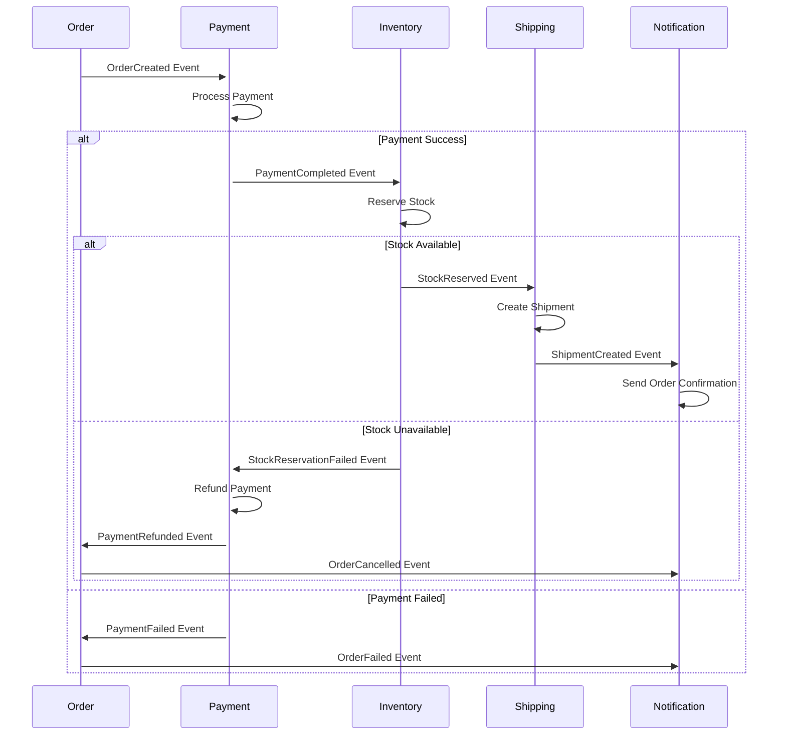
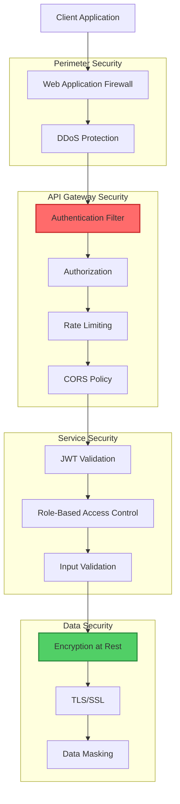
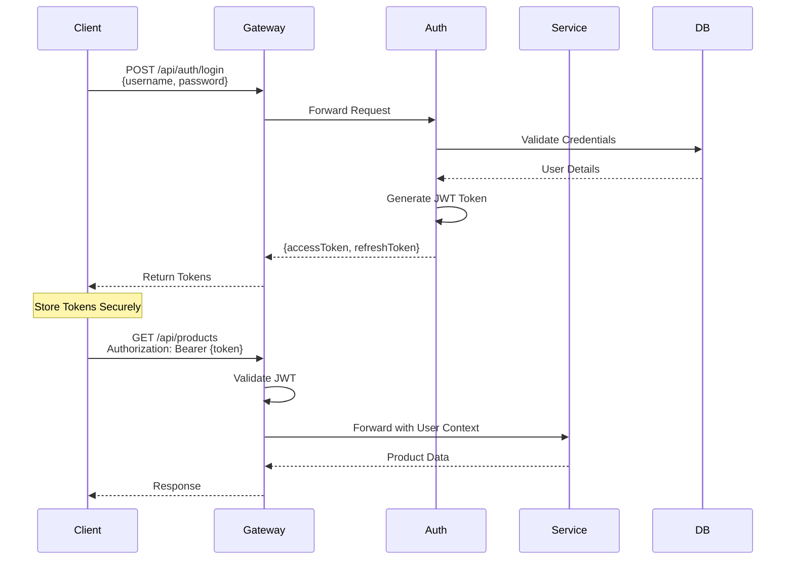
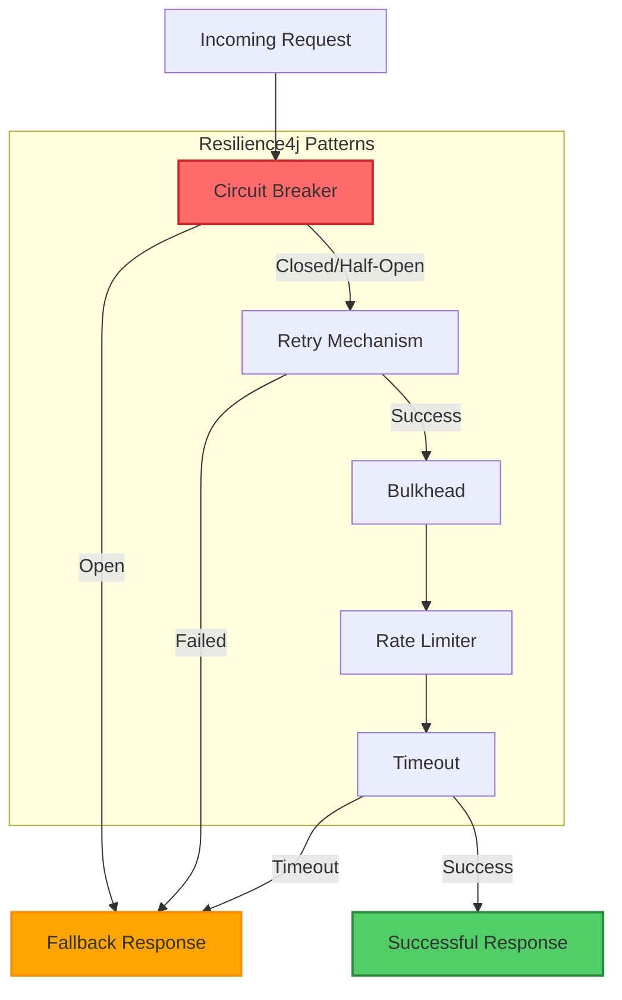
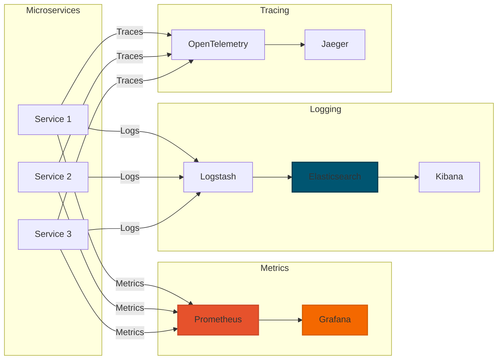
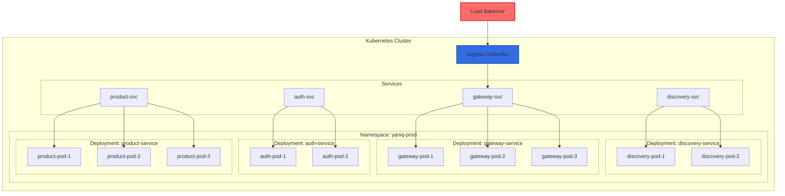

# 🏗️ System Architecture

<div align="center">


**Enterprise-Grade Microservices Architecture for E-Commerce**

[Overview](#-overview) •
[Principles](#-architecture-principles) •
[Components](#-core-components) •
[Patterns](#-design-patterns) •
[Communication](#-communication-patterns)

</div>

---

## 📋 Table of Contents

- [Architecture Overview](#-architecture-overview)
- [Architecture Principles](#-architecture-principles)
- [Core Components](#-core-components)
- [Service Mesh](#-service-mesh-architecture)
- [Design Patterns](#-design-patterns)
- [Communication Patterns](#-communication-patterns)
- [Data Architecture](#-data-architecture)
- [Security Architecture](#-security-architecture)
- [Resilience & Fault Tolerance](#-resilience--fault-tolerance)
- [Observability](#-observability-architecture)
- [Deployment Architecture](#-deployment-architecture)

---

## 🌟 Architecture Overview

YaniQ follows a **Cloud-Native Microservices Architecture** with event-driven communication, leveraging industry-standard patterns and frameworks for building scalable, resilient, and maintainable e-commerce systems.

### High-Level System Architecture



### Logical Architecture Layers



---

## 🎯 Architecture Principles

### 1. **Domain-Driven Design (DDD)**
- Services organized around business domains
- Bounded contexts for each microservice
- Ubiquitous language within teams
- Aggregate roots for data consistency

### 2. **Microservices Patterns**
- **Single Responsibility**: Each service has one clear purpose
- **Loose Coupling**: Services are independent and loosely coupled
- **High Cohesion**: Related functionality grouped together
- **Autonomous**: Services can be deployed independently

### 3. **API-First Design**
- OpenAPI/Swagger specifications
- Contract-first development
- Versioned APIs
- RESTful principles with HATEOAS

### 4. **Event-Driven Architecture**
- Asynchronous communication via events
- Event sourcing for audit trails
- CQRS for read/write separation
- Eventual consistency

### 5. **Cloud-Native Principles**
- 12-Factor App methodology
- Containerized deployments
- Infrastructure as Code
- Horizontal scalability

### 6. **Security by Design**
- Zero-trust security model
- Defense in depth
- Principle of least privilege
- Encryption at rest and in transit

### 7. **Resilience & Fault Tolerance**
- Circuit breaker pattern
- Retry mechanisms with exponential backoff
- Bulkhead isolation
- Graceful degradation

### 8. **Observability**
- Distributed tracing
- Centralized logging
- Metrics and monitoring
- Health checks

---

## 🧩 Core Components

### 1. API Gateway (Port 8080)

**Purpose**: Single entry point for all client requests

**Responsibilities**:
- Request routing and composition
- Authentication and authorization
- Rate limiting and throttling
- Request/response transformation
- Protocol translation (REST, WebSocket)
- API versioning
- CORS handling

**Technology**: Spring Cloud Gateway

**Features**:
```yaml
- Dynamic routing based on service discovery
- Predicate-based routing rules
- Filter chains for request/response processing
- Circuit breaker integration
- Retry and timeout configuration
- Load balancing
```

### 2. Service Discovery (Port 8761) ✅

**Purpose**: Dynamic service registration and discovery

**Responsibilities**:
- Service registration
- Health monitoring
- Service lookup
- Load balancing metadata

**Technology**: Netflix Eureka Server

**Status**: Production Ready

### 3. Configuration Service (Planned)

**Purpose**: Centralized configuration management

**Responsibilities**:
- Externalized configuration
- Environment-specific properties
- Dynamic configuration refresh
- Secret management

**Technology**: Spring Cloud Config Server

### 4. Authentication Service (Port 8081)

**Purpose**: User authentication and authorization

**Responsibilities**:
- User login/logout
- JWT token generation and validation
- Password management
- OAuth2 integration
- Multi-factor authentication (planned)

**Technology**: Spring Security, JWT

### 5. Business Services

Detailed breakdown of each business service:

#### Product Service (Port 8083)
- Product catalog management
- Category hierarchy
- Product attributes and variants
- Image and media management
- Pricing and inventory integration

#### Order Service (Port 8084)
- Order creation and processing
- Order status tracking
- Order history
- Integration with payment, inventory, and shipping

#### Payment Service (Port 8085)
- Payment processing
- Multiple payment gateways
- Transaction management
- Refund processing
- Payment method management

#### Cart Service (Port 8086)
- Shopping cart CRUD operations
- Cart item management
- Price calculations
- Redis-backed for performance

#### Inventory Service (Port 8087)
- Stock level tracking
- Inventory updates
- Low stock alerts
- Multi-warehouse support

---

## 🕸️ Service Mesh Architecture

### Service-to-Service Communication



### Future: Istio Service Mesh (Planned)

- **Traffic Management**: Advanced routing, load balancing
- **Security**: mTLS between services
- **Observability**: Enhanced tracing and metrics
- **Policy Enforcement**: Access control, rate limiting

---

## 🎨 Design Patterns

### 1. API Gateway Pattern

**Problem**: Direct client-to-service communication causes coupling and complexity

**Solution**: Single entry point that routes requests to appropriate services

**Benefits**:
- Simplified client code
- Centralized authentication
- Protocol translation
- Request aggregation

### 2. Service Registry Pattern

**Problem**: Hard-coded service locations are inflexible

**Solution**: Dynamic service registration and discovery (Eureka)

**Benefits**:
- Dynamic scaling
- Service health monitoring
- Location transparency
- Load balancing support

### 3. Circuit Breaker Pattern

**Problem**: Cascading failures can bring down entire system

**Solution**: Resilience4j circuit breaker wraps service calls

**Benefits**:
- Fail fast when service is down
- Automatic recovery
- Fallback mechanisms
- System stability

**Implementation**:
```java
@CircuitBreaker(name = "productService", fallbackMethod = "getProductFallback")
public Product getProduct(Long id) {
    return productClient.getProduct(id);
}

public Product getProductFallback(Long id, Exception ex) {
    return Product.builder()
        .id(id)
        .name("Product Temporarily Unavailable")
        .build();
}
```

### 4. Saga Pattern

**Problem**: Distributed transactions across microservices

**Solution**: Choreography-based saga using Kafka events

**Example: Order Processing Saga**



### 5. CQRS (Command Query Responsibility Segregation)

**Problem**: Different read and write requirements

**Solution**: Separate models for reads and writes

**Benefits**:
- Optimized for specific use cases
- Better performance
- Scalability
- Simplified queries

### 6. Event Sourcing

**Problem**: Need for audit trail and historical data

**Solution**: Store events as the source of truth

**Benefits**:
- Complete audit log
- Temporal queries
- Event replay
- Debugging capabilities

### 7. Database per Service

**Problem**: Shared database creates coupling

**Solution**: Each service owns its database

**Benefits**:
- Service independence
- Technology diversity
- Schema evolution
- Scalability

### 8. Strangler Fig Pattern

**Problem**: Migrating legacy systems

**Solution**: Gradually replace old system with new services

**Benefits**:
- Incremental migration
- Reduced risk
- Continuous delivery

---

## 📡 Communication Patterns

### Synchronous Communication (REST)

**Use Cases**:
- Client-to-service via API Gateway
- Service-to-service for immediate responses
- CRUD operations

**Technology**: Spring WebMVC, Spring WebFlux, Feign Client

**Example**:
```java
@FeignClient(name = "product-service")
public interface ProductClient {
    @GetMapping("/api/products/{id}")
    Product getProduct(@PathVariable Long id);
}
```

### Asynchronous Communication (Events)

**Use Cases**:
- Event notifications
- Background processing
- Cross-service data synchronization
- Audit logging

**Technology**: Apache Kafka, Spring Cloud Stream

**Example**:
```java
@Component
public class OrderEventPublisher {
    
    @Autowired
    private KafkaTemplate<String, OrderEvent> kafkaTemplate;
    
    public void publishOrderCreated(Order order) {
        OrderEvent event = new OrderEvent(order);
        kafkaTemplate.send("order-events", event);
    }
}

@Component
public class OrderEventListener {
    
    @KafkaListener(topics = "order-events", groupId = "inventory-service")
    public void handleOrderCreated(OrderEvent event) {
        // Reserve inventory
    }
}
```

### Communication Decision Matrix

| Scenario | Pattern | Technology | Reason |
|----------|---------|------------|--------|
| User places order | Synchronous | REST | Immediate response needed |
| Send order confirmation | Asynchronous | Kafka | Fire and forget |
| Update inventory | Asynchronous | Kafka | Eventual consistency OK |
| Get product details | Synchronous | REST | Real-time data required |
| Process payment | Synchronous | REST | Immediate confirmation needed |
| Analytics update | Asynchronous | Kafka | Background processing |

---

## 💾 Data Architecture

### Database Strategy

#### 1. Database per Service

Each microservice has its own database schema:

```yaml
Services and Their Databases:
  auth-service:
    database: auth_db
    tables: [users, roles, permissions, tokens]
  
  user-service:
    database: user_db
    tables: [user_profiles, addresses, preferences]
  
  product-service:
    database: product_db
    tables: [products, categories, variants, images]
  
  order-service:
    database: order_db
    tables: [orders, order_items, order_status_history]
  
  payment-service:
    database: payment_db
    tables: [transactions, payment_methods, refunds]
  
  inventory-service:
    database: inventory_db
    tables: [stock_levels, warehouses, stock_movements]
```

#### 2. Caching Strategy

**Redis Usage**:
- Session storage
- Product catalog cache
- Shopping cart persistence
- Rate limiting counters
- Distributed locks

**Cache Pattern**:
```java
@Cacheable(value = "products", key = "#id")
public Product getProduct(Long id) {
    return productRepository.findById(id)
        .orElseThrow(() -> new ProductNotFoundException(id));
}

@CacheEvict(value = "products", key = "#product.id")
public Product updateProduct(Product product) {
    return productRepository.save(product);
}
```

#### 3. Search Index

**Elasticsearch Usage**:
- Product full-text search
- Faceted search and filtering
- Auto-complete suggestions
- Analytics and aggregations

### Data Consistency Patterns

#### Strong Consistency
- Within service boundaries
- ACID transactions in PostgreSQL
- For critical operations (payments)

#### Eventual Consistency
- Cross-service data
- Event-driven updates
- For non-critical operations (analytics)

#### Saga Pattern
- Distributed transactions
- Compensating transactions
- For business workflows (order processing)

---

## 🔒 Security Architecture

### Security Layers



### Authentication Flow



### Security Features

✅ **Authentication**
- JWT-based authentication
- OAuth2 integration (planned)
- Multi-factor authentication (planned)
- Session management

✅ **Authorization**
- Role-based access control (RBAC)
- Permission-based access
- Resource-level authorization
- API key authentication (for external APIs)

✅ **Data Protection**
- Encryption at rest (database)
- TLS/SSL for data in transit
- Sensitive data masking
- PII data protection

✅ **API Security**
- Rate limiting per user/IP
- CORS configuration
- Input validation
- SQL injection prevention
- XSS protection

---

## 🛡️ Resilience & Fault Tolerance

### Resilience Patterns Implementation



### Configuration Example

```yaml
resilience4j:
  circuitbreaker:
    instances:
      productService:
        registerHealthIndicator: true
        slidingWindowSize: 10
        minimumNumberOfCalls: 5
        permittedNumberOfCallsInHalfOpenState: 3
        automaticTransitionFromOpenToHalfOpenEnabled: true
        waitDurationInOpenState: 5s
        failureRateThreshold: 50
        eventConsumerBufferSize: 10
  
  retry:
    instances:
      productService:
        maxAttempts: 3
        waitDuration: 1s
        exponentialBackoffMultiplier: 2
        retryExceptions:
          - org.springframework.web.client.HttpServerErrorException
          - java.net.ConnectException
  
  bulkhead:
    instances:
      productService:
        maxConcurrentCalls: 10
        maxWaitDuration: 0
  
  ratelimiter:
    instances:
      productService:
        limitForPeriod: 100
        limitRefreshPeriod: 1s
        timeoutDuration: 0
```

---

## 📊 Observability Architecture

### Three Pillars of Observability



### Monitoring Stack

**1. Metrics (Prometheus + Grafana)**
- Application metrics (request rate, error rate, duration)
- JVM metrics (heap, GC, threads)
- Custom business metrics
- Infrastructure metrics

**2. Logging (ELK Stack)**
- Centralized log aggregation
- Structured logging with JSON
- Log correlation with trace IDs
- Log-based alerting

**3. Tracing (OpenTelemetry + Jaeger)**
- Distributed request tracing
- Service dependency mapping
- Latency analysis
- Error tracking

---

## 🚀 Deployment Architecture

### Container Orchestration



### Deployment Strategies

**1. Rolling Deployment** (Default)
- Zero-downtime deployments
- Gradual instance replacement
- Automatic rollback on failure

**2. Blue-Green Deployment** (Planned)
- Two identical environments
- Instant switchover
- Easy rollback

**3. Canary Deployment** (Planned)
- Gradual traffic shift
- Risk mitigation
- A/B testing capability

---

## 📚 Related Documentation

- 🚀 [Getting Started](./GETTING_STARTED.md)
- ⚙️ [Configuration Guide](./CONFIGURATION.md)
- 🚢 [Deployment Guide](./DEPLOYMENT.md)
- 🔍 [Discovery Service](./services/DISCOVERY_SERVICE.md)
- 🌐 [API Documentation](./SWAGGER_DOCUMENTATION.md)

---

<div align="center">

**System Architecture** | **YaniQ E-Commerce Platform**

[⬆ Back to Top](#-system-architecture) | [📖 Main Documentation](./README.md)

</div>
