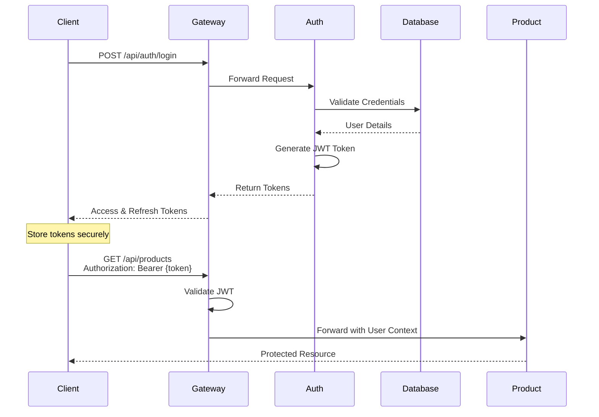

# 🔐 Auth Service Documentation

<div align="center">


**Authentication & Authorization Service**

</div>

---

## 📋 Overview

The **Auth Service** handles all authentication and authorization concerns for the YaniQ platform. It provides secure user authentication, JWT token management, and role-based access control.

### Key Features

- 🔐 **User Authentication** - Login/logout with JWT tokens
- 🔄 **Token Management** - Access and refresh tokens
- 🔑 **Password Management** - Reset, recovery, and change
- 👥 **Role-Based Access** - RBAC implementation
- 🔒 **OAuth2 Integration** - Social login support (planned)
- 🛡️ **Security** - BCrypt password hashing, rate limiting

---

## 🎯 Authentication Flow



---

## 📡 API Endpoints

### Authentication

#### Login
```http
POST /api/auth/login
Content-Type: application/json

{
  "username": "user@example.com",
  "password": "securePassword123"
}

Response:
{
  "accessToken": "eyJhbGciOiJIUzI1NiIs...",
  "refreshToken": "eyJhbGciOiJIUzI1NiIs...",
  "tokenType": "Bearer",
  "expiresIn": 86400
}
```

#### Refresh Token
```http
POST /api/auth/refresh
Content-Type: application/json

{
  "refreshToken": "eyJhbGciOiJIUzI1NiIs..."
}

Response:
{
  "accessToken": "newAccessToken...",
  "refreshToken": "newRefreshToken...",
  "expiresIn": 86400
}
```

#### Logout
```http
POST /api/auth/logout
Authorization: Bearer {accessToken}

Response: 204 No Content
```

### Password Management

#### Change Password
```http
PUT /api/auth/password/change
Authorization: Bearer {accessToken}
Content-Type: application/json

{
  "currentPassword": "oldPassword",
  "newPassword": "newSecurePassword123"
}
```

#### Forgot Password
```http
POST /api/auth/password/forgot
Content-Type: application/json

{
  "email": "user@example.com"
}
```

#### Reset Password
```http
POST /api/auth/password/reset
Content-Type: application/json

{
  "token": "resetToken",
  "newPassword": "newSecurePassword123"
}
```

---

## 🔧 Configuration

### JWT Configuration

```yaml
jwt:
  secret: ${JWT_SECRET}
  expiration: 86400000  # 24 hours
  refresh-expiration: 604800000  # 7 days
  header: Authorization
  prefix: "Bearer "
  issuer: yaniq-platform
```

### Database Configuration

```yaml
spring:
  datasource:
    url: jdbc:postgresql://localhost:5432/auth_db
    username: ${POSTGRES_USER}
    password: ${POSTGRES_PASSWORD}
  
  jpa:
    hibernate:
      ddl-auto: validate
    properties:
      hibernate:
        dialect: org.hibernate.dialect.PostgreSQLDialect
```

---

## 🗄️ Database Schema

### Users Table
```sql
CREATE TABLE users (
    id BIGSERIAL PRIMARY KEY,
    username VARCHAR(255) UNIQUE NOT NULL,
    email VARCHAR(255) UNIQUE NOT NULL,
    password_hash VARCHAR(255) NOT NULL,
    enabled BOOLEAN DEFAULT true,
    account_non_expired BOOLEAN DEFAULT true,
    account_non_locked BOOLEAN DEFAULT true,
    credentials_non_expired BOOLEAN DEFAULT true,
    created_at TIMESTAMP DEFAULT CURRENT_TIMESTAMP,
    updated_at TIMESTAMP DEFAULT CURRENT_TIMESTAMP
);

CREATE INDEX idx_users_email ON users(email);
CREATE INDEX idx_users_username ON users(username);
```

### Roles Table
```sql
CREATE TABLE roles (
    id BIGSERIAL PRIMARY KEY,
    name VARCHAR(50) UNIQUE NOT NULL,
    description VARCHAR(255),
    created_at TIMESTAMP DEFAULT CURRENT_TIMESTAMP
);

CREATE TABLE user_roles (
    user_id BIGINT REFERENCES users(id) ON DELETE CASCADE,
    role_id BIGINT REFERENCES roles(id) ON DELETE CASCADE,
    PRIMARY KEY (user_id, role_id)
);
```

### Refresh Tokens Table
```sql
CREATE TABLE refresh_tokens (
    id BIGSERIAL PRIMARY KEY,
    user_id BIGINT REFERENCES users(id) ON DELETE CASCADE,
    token VARCHAR(500) UNIQUE NOT NULL,
    expires_at TIMESTAMP NOT NULL,
    created_at TIMESTAMP DEFAULT CURRENT_TIMESTAMP
);

CREATE INDEX idx_refresh_tokens_token ON refresh_tokens(token);
CREATE INDEX idx_refresh_tokens_user_id ON refresh_tokens(user_id);
```

---

## 🔒 Security Implementation

### Password Hashing

```java
@Configuration
public class SecurityConfig {
    
    @Bean
    public PasswordEncoder passwordEncoder() {
        return new BCryptPasswordEncoder(10);
    }
}
```

### JWT Token Generation

```java
@Service
public class JwtTokenProvider {
    
    @Value("${jwt.secret}")
    private String jwtSecret;
    
    @Value("${jwt.expiration}")
    private long jwtExpirationMs;
    
    public String generateToken(Authentication authentication) {
        UserPrincipal userPrincipal = (UserPrincipal) authentication.getPrincipal();
        
        Date now = new Date();
        Date expiryDate = new Date(now.getTime() + jwtExpirationMs);
        
        return Jwts.builder()
            .setSubject(Long.toString(userPrincipal.getId()))
            .setIssuedAt(now)
            .setExpiration(expiryDate)
            .signWith(SignatureAlgorithm.HS512, jwtSecret)
            .compact();
    }
}
```

---

## 🚀 Running the Service

```bash
# Start dependencies
docker-compose up -d postgres redis

# Run service
cd apps/auth-service
mvn spring-boot:run

# Verify
curl http://localhost:8081/actuator/health
```

---

## 🧪 Testing

### Test Login

```bash
# Register new user (if registration endpoint exists)
curl -X POST http://localhost:8080/api/auth/register \
  -H "Content-Type: application/json" \
  -d '{
    "username": "testuser",
    "email": "test@example.com",
    "password": "Test123!@#"
  }'

# Login
curl -X POST http://localhost:8080/api/auth/login \
  -H "Content-Type: application/json" \
  -d '{
    "username": "testuser",
    "password": "Test123!@#"
  }'

# Use token
TOKEN="your-access-token"
curl http://localhost:8080/api/users/me \
  -H "Authorization: Bearer $TOKEN"
```

---

## 📊 Monitoring

```bash
# Health check
curl http://localhost:8081/actuator/health

# Metrics
curl http://localhost:8081/actuator/metrics

# Active sessions
curl http://localhost:8081/actuator/metrics/auth.active.sessions
```

---

<div align="center">

**Auth Service** | **Status**: 🚧 In Development

[⬆ Back to Services](../README.md#-services) | [📖 Main Documentation](../README.md)

</div>
# 🌐 Gateway Service Documentation

<div align="center">


**API Gateway for YaniQ Microservices Platform**

</div>

---

## 📋 Overview

The **Gateway Service** serves as the single entry point for all client requests in the YaniQ platform. Built on **Spring Cloud Gateway**, it provides intelligent routing, load balancing, security, and cross-cutting concerns for all microservices.

### Key Responsibilities

- 🌐 **Request Routing** - Route requests to appropriate microservices
- 🔒 **Authentication** - Validate JWT tokens
- ⚖️ **Load Balancing** - Distribute requests across service instances
- 🚦 **Rate Limiting** - Prevent API abuse
- 🔄 **Circuit Breaking** - Handle service failures gracefully
- 📊 **Monitoring** - Track request metrics and logs
- 🌍 **CORS Handling** - Manage cross-origin requests

---

## 🎯 Features

### ✅ Dynamic Routing
- Service discovery integration with Eureka
- Predicate-based routing rules
- Path rewriting and URI manipulation

### ✅ Security
- JWT token validation
- Role-based access control
- API key authentication for external APIs

### ✅ Resilience
- Circuit breaker integration
- Retry mechanisms
- Timeout configuration
- Fallback responses

### ✅ Rate Limiting
- Redis-backed rate limiting
- Per-user/IP rate limits
- Configurable limits per endpoint

### ✅ Request/Response Transformation
- Header manipulation
- Request/response filtering
- Protocol conversion

---

## ⚙️ Configuration

### Route Configuration

**File**: `config/gateway-service.yml`

```yaml
spring:
  cloud:
    gateway:
      discovery:
        locator:
          enabled: true
          lower-case-service-id: true
      
      routes:
        # Authentication Routes
        - id: auth-service
          uri: lb://auth-service
          predicates:
            - Path=/api/auth/**
          filters:
            - StripPrefix=1
            - name: RequestRateLimiter
              args:
                redis-rate-limiter.replenishRate: 10
                redis-rate-limiter.burstCapacity: 20
        
        # User Service Routes
        - id: user-service
          uri: lb://user-service
          predicates:
            - Path=/api/users/**
          filters:
            - StripPrefix=1
            - name: CircuitBreaker
              args:
                name: userServiceCircuitBreaker
                fallbackUri: forward:/fallback/users
        
        # Product Service Routes
        - id: product-service
          uri: lb://product-service
          predicates:
            - Path=/api/products/**
          filters:
            - StripPrefix=1
            - name: Retry
              args:
                retries: 3
                statuses: BAD_GATEWAY,SERVICE_UNAVAILABLE
                methods: GET
                backoff:
                  firstBackoff: 10ms
                  maxBackoff: 50ms
                  factor: 2
```

### Rate Limiting Configuration

```yaml
spring:
  redis:
    host: ${REDIS_HOST:localhost}
    port: ${REDIS_PORT:6379}
    password: ${REDIS_PASSWORD:}

  cloud:
    gateway:
      filter:
        request-rate-limiter:
          redis-rate-limiter:
            replenish-rate: 100  # Tokens per second
            burst-capacity: 200  # Maximum burst size
```

### CORS Configuration

```yaml
spring:
  cloud:
    gateway:
      globalcors:
        cors-configurations:
          '[/**]':
            allowed-origins:
              - "http://localhost:3000"
              - "https://app.yaniq.com"
            allowed-methods:
              - GET
              - POST
              - PUT
              - DELETE
              - PATCH
              - OPTIONS
            allowed-headers: "*"
            exposed-headers:
              - Authorization
            allow-credentials: true
            max-age: 3600
```

---

## 🚀 Running the Service

### Prerequisites
- Discovery Service running on port 8761
- Redis running (for rate limiting)

### Start the Service

```bash
# Using Maven
cd apps/gateway-service
mvn spring-boot:run

# Using Docker
docker-compose up -d gateway-service

# Verify
curl http://localhost:8080/actuator/health
```

---

## 📡 API Endpoints

### Gateway Management

```bash
# List all routes
GET http://localhost:8080/actuator/gateway/routes

# Get specific route
GET http://localhost:8080/actuator/gateway/routes/{id}

# Refresh routes
POST http://localhost:8080/actuator/gateway/refresh
```

### Example Requests

```bash
# Login through gateway
curl -X POST http://localhost:8080/api/auth/login \
  -H "Content-Type: application/json" \
  -d '{"username":"user","password":"pass"}'

# Get products through gateway
curl http://localhost:8080/api/products \
  -H "Authorization: Bearer {token}"

# Get user profile through gateway
curl http://localhost:8080/api/users/me \
  -H "Authorization: Bearer {token}"
```

---

## 🔐 Security Integration

### JWT Filter

```java
@Component
public class JwtAuthenticationFilter implements GatewayFilter {
    
    @Override
    public Mono<Void> filter(ServerWebExchange exchange, GatewayFilterChain chain) {
        String token = extractToken(exchange.getRequest());
        
        if (token != null && jwtUtil.validateToken(token)) {
            return chain.filter(exchange);
        }
        
        exchange.getResponse().setStatusCode(HttpStatus.UNAUTHORIZED);
        return exchange.getResponse().setComplete();
    }
}
```

---

## 📊 Monitoring

### Metrics

```bash
# Gateway metrics
curl http://localhost:8080/actuator/metrics/gateway.requests

# Route-specific metrics
curl http://localhost:8080/actuator/metrics/spring.cloud.gateway.requests
```

---

## 🔧 Troubleshooting

### Common Issues

1. **503 Service Unavailable** - Check if backend services are registered with Eureka
2. **CORS Errors** - Verify CORS configuration
3. **Rate Limit Exceeded** - Check Redis connection and rate limit configuration

---

<div align="center">

**Gateway Service** | **Status**: 🚧 In Development

[⬆ Back to Services](../README.md#-services) | [📖 Main Documentation](../README.md)

</div>
