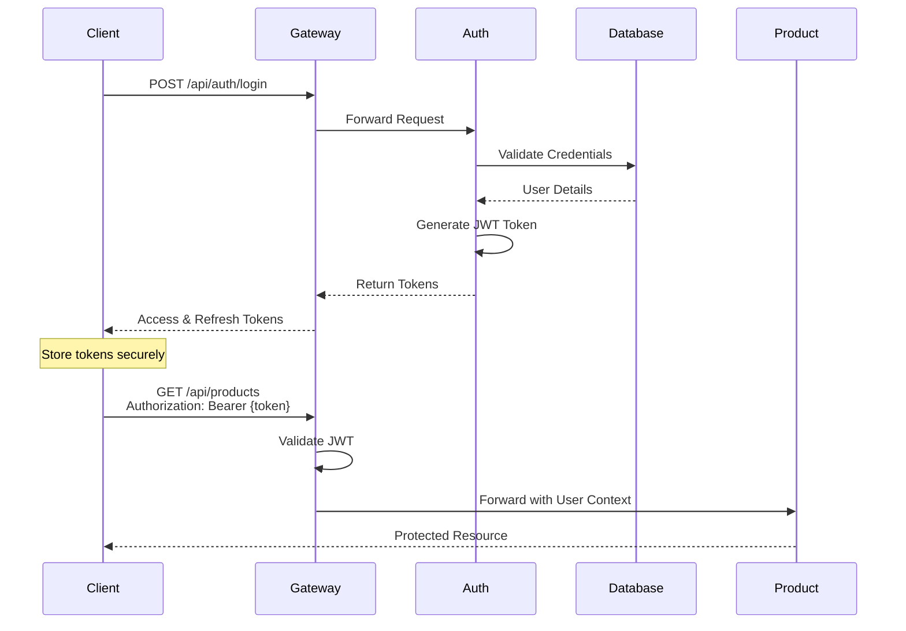

# 🔐 Auth Service Documentation

<div class="text-center">


**Authentication & Authorization Service**

</div>

---

## 🗂️ Overview

The **Auth Service** handles all authentication and authorization concerns for the YaniQ platform. It provides secure user authentication, JWT token management, and role-based access control.

### Key Features

- 🔐 **User Authentication** - Login/logout with JWT tokens
- 🔄 **Token Management** - Access and refresh tokens
- 🔑 **Password Management** - Reset, recovery, and change
- 👥 **Role-Based Access** - RBAC implementation
- 🔒 **OAuth2 Integration** - Social login support (planned)
- 🛡️ **Security** - BCrypt password hashing, rate limiting

---

## 🧭 Authentication Flow



---

## 📡 API Endpoints

### Authentication

#### Login
```http
POST /api/auth/login
Content-Type: application/json

{
  "username": "user@example.com",
  "password": "securePassword123"
}

Response:
{
  "accessToken": "eyJhbGciOiJIUzI1NiIs...",
  "refreshToken": "eyJhbGciOiJIUzI1NiIs...",
  "tokenType": "Bearer",
  "expiresIn": 86400
}
```

#### Refresh Token
```http
POST /api/auth/refresh
Content-Type: application/json

{
  "refreshToken": "eyJhbGciOiJIUzI1NiIs..."
}

Response:
{
  "accessToken": "newAccessToken...",
  "refreshToken": "newRefreshToken...",
  "expiresIn": 86400
}
```

#### Logout
```http
POST /api/auth/logout
Authorization: Bearer {accessToken}

Response: 204 No Content
```

### Password Management

#### Change Password
```http
PUT /api/auth/password/change
Authorization: Bearer {accessToken}
Content-Type: application/json

{
  "currentPassword": "oldPassword",
  "newPassword": "newSecurePassword123"
}
```

#### Forgot Password
```http
POST /api/auth/password/forgot
Content-Type: application/json

{
  "email": "user@example.com"
}
```

#### Reset Password
```http
POST /api/auth/password/reset
Content-Type: application/json

{
  "token": "resetToken",
  "newPassword": "newSecurePassword123"
}
```

---

## ⚙️ Configuration

### JWT Configuration

```yaml
jwt:
  secret: ${JWT_SECRET}
  expiration: 86400000  # 24 hours
  refresh-expiration: 604800000  # 7 days
  header: Authorization
  prefix: "Bearer "
  issuer: yaniq-platform
```

### Database Configuration

```yaml
spring:
  datasource:
    url: jdbc:postgresql://localhost:5432/auth_db
    username: ${POSTGRES_USER}
    password: ${POSTGRES_PASSWORD}
  
  jpa:
    hibernate:
      ddl-auto: validate
    properties:
      hibernate:
        dialect: org.hibernate.dialect.PostgreSQLDialect
```

---

## 🗄️ Database Schema

### Users Table
```sql
CREATE TABLE users (
    id BIGSERIAL PRIMARY KEY,
    username VARCHAR(255) UNIQUE NOT NULL,
    email VARCHAR(255) UNIQUE NOT NULL,
    password_hash VARCHAR(255) NOT NULL,
    enabled BOOLEAN DEFAULT true,
    account_non_expired BOOLEAN DEFAULT true,
    account_non_locked BOOLEAN DEFAULT true,
    credentials_non_expired BOOLEAN DEFAULT true,
    created_at TIMESTAMP DEFAULT CURRENT_TIMESTAMP,
    updated_at TIMESTAMP DEFAULT CURRENT_TIMESTAMP
);

CREATE INDEX idx_users_email ON users(email);
CREATE INDEX idx_users_username ON users(username);
```

### Roles Table
```sql
CREATE TABLE roles (
    id BIGSERIAL PRIMARY KEY,
    name VARCHAR(50) UNIQUE NOT NULL,
    description VARCHAR(255),
    created_at TIMESTAMP DEFAULT CURRENT_TIMESTAMP
);

CREATE TABLE user_roles (
    user_id BIGINT REFERENCES users(id) ON DELETE CASCADE,
    role_id BIGINT REFERENCES roles(id) ON DELETE CASCADE,
    PRIMARY KEY (user_id, role_id)
);
```

### Refresh Tokens Table
```sql
CREATE TABLE refresh_tokens (
    id BIGSERIAL PRIMARY KEY,
    user_id BIGINT REFERENCES users(id) ON DELETE CASCADE,
    token VARCHAR(500) UNIQUE NOT NULL,
    expires_at TIMESTAMP NOT NULL,
    created_at TIMESTAMP DEFAULT CURRENT_TIMESTAMP
);

CREATE INDEX idx_refresh_tokens_token ON refresh_tokens(token);
CREATE INDEX idx_refresh_tokens_user_id ON refresh_tokens(user_id);
```

---

## 🔐 Security Implementation

### Password Hashing

```java
@Configuration
public class SecurityConfig {
    
    @Bean
    public PasswordEncoder passwordEncoder() {
        return new BCryptPasswordEncoder(10);
    }
}
```

### JWT Token Generation

```java
@Service
public class JwtTokenProvider {
    
    @Value("${jwt.secret}")
    private String jwtSecret;
    
    @Value("${jwt.expiration}")
    private long jwtExpirationMs;
    
    public String generateToken(Authentication authentication) {
        UserPrincipal userPrincipal = (UserPrincipal) authentication.getPrincipal();
        
        Date now = new Date();
        Date expiryDate = new Date(now.getTime() + jwtExpirationMs);
        
        return Jwts.builder()
            .setSubject(Long.toString(userPrincipal.getId()))
            .setIssuedAt(now)
            .setExpiration(expiryDate)
            .signWith(SignatureAlgorithm.HS512, jwtSecret)
            .compact();
    }
}
```

---

## 🚀 Running the Service

```bash
# Start dependencies
docker-compose up -d postgres redis

# Run service
cd apps/auth-service
mvn spring-boot:run

# Verify
curl http://localhost:8081/actuator/health
```

---

## 🧪 Testing

### Test Login

```bash
# Register new user (if registration endpoint exists)
curl -X POST http://localhost:8080/api/auth/register \
  -H "Content-Type: application/json" \
  -d '{
    "username": "testuser",
    "email": "test@example.com",
    "password": "Test123!@#"
  }'

# Login
curl -X POST http://localhost:8080/api/auth/login \
  -H "Content-Type: application/json" \
  -d '{
    "username": "testuser",
    "password": "Test123!@#"
  }'

# Use token
TOKEN="your-access-token"
curl http://localhost:8080/api/users/me \
  -H "Authorization: Bearer $TOKEN"
```

---

## 📈 Monitoring

```bash
# Health check
curl http://localhost:8081/actuator/health

# Metrics
curl http://localhost:8081/actuator/metrics

# Active sessions
curl http://localhost:8081/actuator/metrics/auth.active.sessions
```

---

<div class="text-center">

**Auth Service** | **Status**: 🚧 In Development

[⬅ Back to Services]({{ site.baseurl }}/services/) | [🏠 Home]({{ site.baseurl }}/)

</div>
